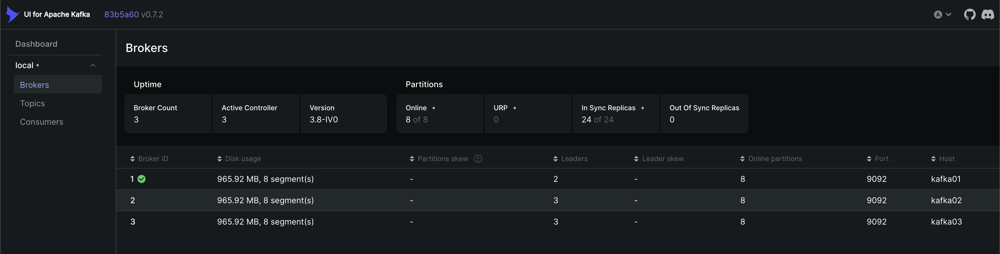
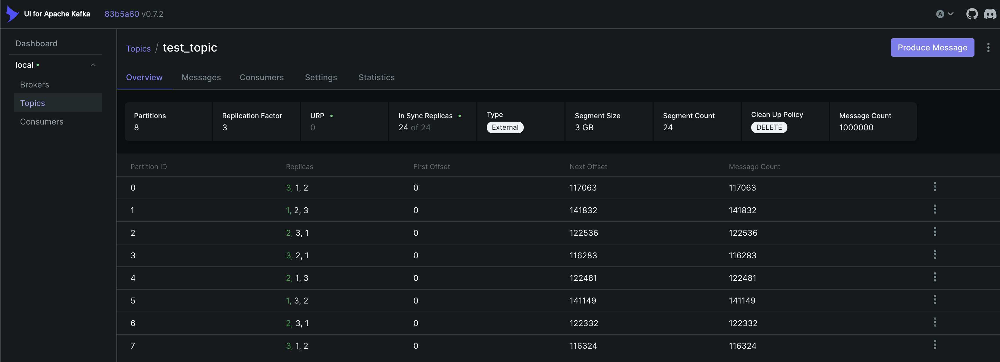
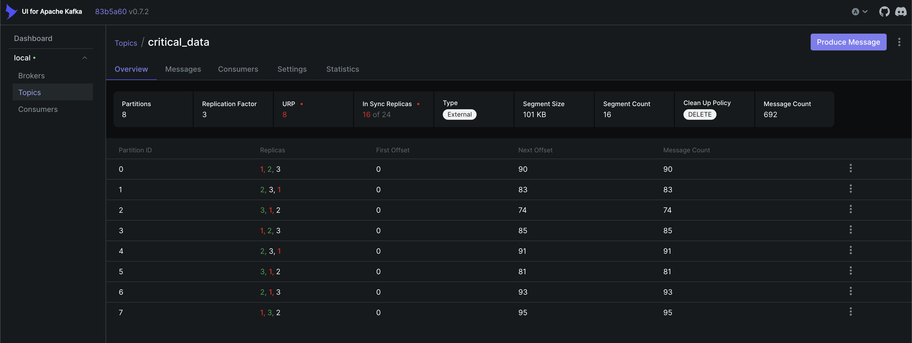
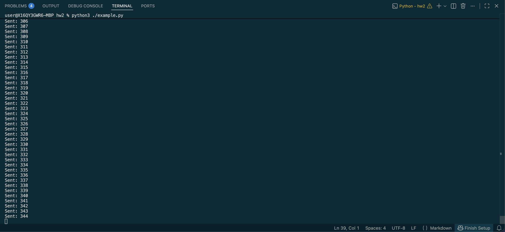
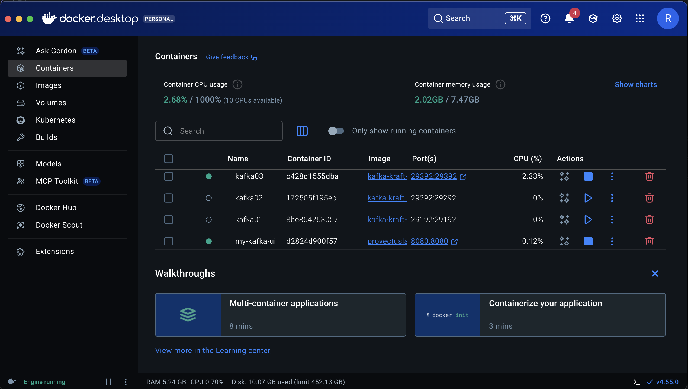
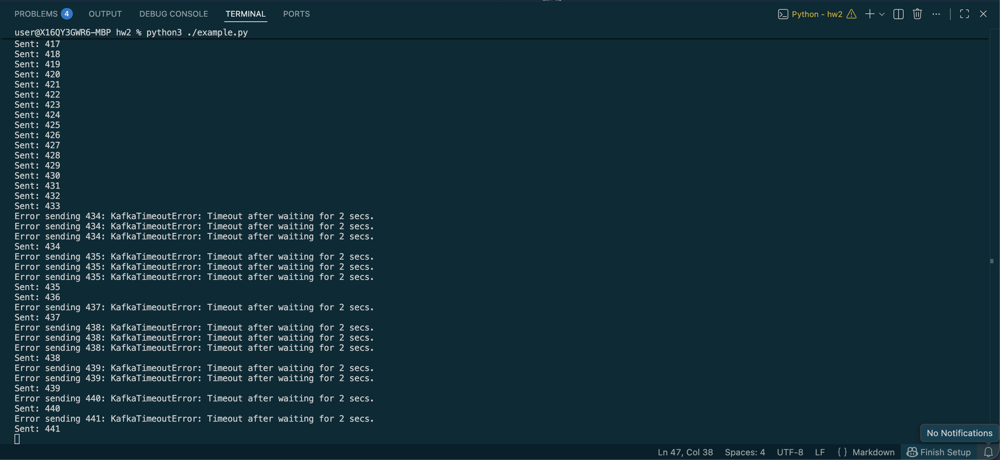
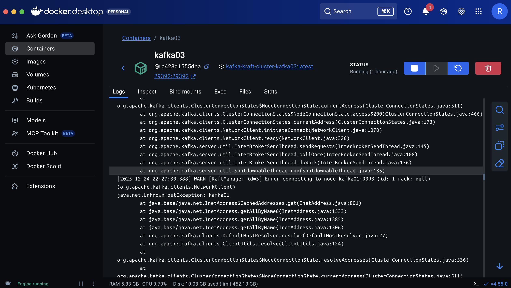
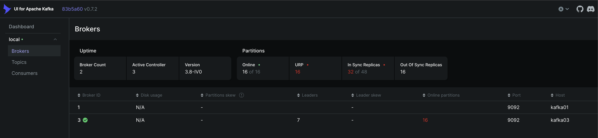
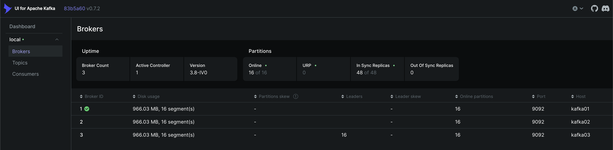

# HW 2 — Kafka Cluster, Scalability & Fault Tolerance

## 1. Конфигурация топика test_topic
В кластере три брокера без zookeeper, кворум составляет два брокера. При падении двух брокеров кворум не соблюдается и кластер становится недоступным для записи. Доступно 8 партиций для параллельной записи данных, а также распределения нагрузки. Replication factor = 3, следовательно каждая партиция хранится на всех трех брокерах. 

Если упадет только один брокер, то кластер продолжит работать, а лидеры партиций будут заново избраны

## 2. Нагрузочное тестирование (producer-perf-test)

```bash
user@X16QY3GWR6-MBP kafka-kraft-cluster % docker run -it --rm --network kafka-kraft-cluster_default confluentinc/cp-kafka /bin/kafka-producer-perf-test --topic test_topic --num-records 1000000 --throughput -1 --producer-props bootstrap.servers=kafka01:9092,kafka02:9092,kafka03:9092 batch.size=16384 acks=1 linger.ms=50 --record-size 1000

879744 records sent, 175948.8 records/sec (167.80 MB/sec), 112.8 ms avg latency, 421.0 ms max latency.
1000000 records sent, 183519.9 records/sec (175.02 MB/sec), 99.59 ms avg latency, 421.00 ms max latency, 63 ms 50th, 297 ms 95th, 373 ms 99th, 415 ms 99.9th.
```

В ходе тестирования продюсера был достигнут throughput порядка 180 тыс. сообщений в секунду при размере сообщения 1000 байт, что соответствует ~175 MB/s. В среднем latency составил 100 мс.

### Скриншоты Kafka-UI



Тут видно, что messages count равен 1 000 000

## 3. Отказоустойчивость кластера

### 3.1 Убийство контроллера

Запускаю example.py, останавливаю контейнер kafka01, на котором был брокер-контроллер


В kafka_ui вижу, что контроллер был переизбран (теперь это kafka02), а кол-во брокеров стало равно 2. URP стал равен 16, значит 16 партиций не имеют достаточного кол-ва реплик, что логично, учитывая, что мы указали replication_factor = 3, а один брокер умер



Каждая партиция имеет 2 реплики вместо 3, поэтому они помечены как under-replicated



При этом сообщения продолжают лететь в кластер

### 3.2 Убийство 2/3

Отключаю контейнер с новым контроллером



Сразу вижу, что начали появляться ошибки, но сообщения долетают периодически, полагаю, что дело в кэше



В логах последнего живого брокера наблюдаются ошибки RaftManager, связанные с невозможностью установить соединение с отсутствующими узлами, что подтверждает потерю кворума



### 3.3 Восстановление

Оживил первый брокер, сообщения начали долетать


Однако ISR все еще 32 из 48, так как кол-во реплицированных партиций не соответствует тому, что указано в конфиге



После оживления последнего брокера все показатели вернулись в норму


