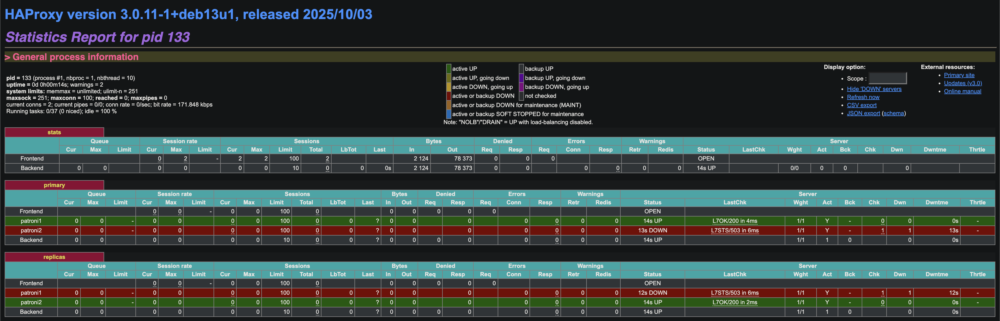

## Сборка и запуск кластера Patroni

После сборки образа и запуска docker compose зашёл внутрь одного из контейнеров Patroni и посмотрел состояние кластера через patronictl.

```bash
user@X16QY3GWR6-MBP patroni-master % docker exec -it demo-patroni1 patronictl list

+ Cluster: demo (7587570106181255191) --------+----+-------------+-----+------------+-----+
| Member   | Host       | Role    | State     | TL | Receive LSN | Lag | Replay LSN | Lag |
+----------+------------+---------+-----------+----+-------------+-----+------------+-----+
| patroni1 | 172.20.0.8 | Leader  | running   |  1 |             |     |            |     |
| patroni2 | 172.20.0.5 | Replica | streaming |  1 |   0/404FA28 |   0 |  0/404FA28 |   0 |
| patroni3 | 172.20.0.7 | Replica | streaming |  1 |   0/404FA28 |   0 |  0/404FA28 |   0 |
+----------+------------+---------+-----------+----+-------------+-----+------------+-----+
user@X16QY3GWR6-MBP patroni-master % 
```

По выводу видно, что в кластере три ноды:
patroni1 — лидер, а patroni2 и patroni3 — реплики

## Запуск скрипта

```bash
user@X16QY3GWR6-MBP hw3 % python3 traffic-generator.py

--- STARTING LOAD GENERATOR ON PORT 5500 ---

[02:51:14] CONNECTED to Master Node
[02:51:14] INSERT: click by Алексей Козлов
READ check (Last 3 IDs): [3, 2, 1]
[02:51:15] INSERT: login by Мария Сидорова
[02:51:16] INSERT: logout by Мария Сидорова
READ check (Last 3 IDs): [5, 4, 3]
[02:51:17] INSERT: purchase by Мария Сидорова
[02:51:18] INSERT: login by Мария Сидорова
READ check (Last 3 IDs): [7, 6, 5]
[02:51:19] INSERT: click by Алексей Козлов
...
```

В соседнем окне терминала делаю docker stop demo-patroni1




Далее скрипт ломается

```bash
[02:54:17] INSERT: click by Мария Сидорова 
[02:54:18] INSERT: logout by Мария Сидорова READ check (Last 3 IDs): [185, 184, 183] 
[02:54:19] INSERT: login by Иван Петров 
[02:54:20] INSERT: view_page by Мария Сидорова READ check (Last 3 IDs): [187, 186, 185]
[02:54:21] CONNECTION LOST (Failover in progress?): server closed the connection unexpectedly This probably means the server terminated abnormally before or while processing the request. 

[02:54:34] Connection failed: connection to server at "localhost" (::1), port 5500 failed: server closed the connection unexpectedly This probably means the server terminated abnormally before or while processing the request.
```

В момент падения лидера активные клиентские соединения разрываются, происходит выбор нового лидера, на это время соединение теряется. Далее я перезапускаю скрипт и запросы вновь поступают нормально.

```bash
...
[03:01:55] INSERT: logout by Иван Петров
[03:01:56] INSERT: view_page by Иван Петров
READ check (Last 3 IDs): [321, 320, 319]
[03:01:57] INSERT: logout by Алексей Козлов
[03:01:58] INSERT: login by Мария Сидорова
READ check (Last 3 IDs): [323, 322, 321]
[03:01:59] INSERT: view_page by Алексей Козлов
[03:02:00] INSERT: click by Мария Сидорова
READ check (Last 3 IDs): [325, 324, 323]
[03:02:01] INSERT: click by Иван Петров
[03:02:02] INSERT: error by Иван Петров
READ check (Last 3 IDs): [327, 326, 325]
[03:02:03] INSERT: login by Алексей Козлов
[03:02:04] INSERT: view_page by Алексей Козлов
READ check (Last 3 IDs): [329, 328, 327]
[03:02:05] INSERT: click by Мария Сидорова
[03:02:06] INSERT: error by Алексей Козлов
READ check (Last 3 IDs): [331, 330, 329]
```

После включения лидера, он становится репликой
```bash

# СТАРТ

user@X16QY3GWR6-MBP system-design-practice-hse-miem-25-26 % docker exec -it demo-patroni1 patronictl list
+ Cluster: demo (7587572879942049815) --------+----+-------------+-----+------------+-----+
| Member   | Host       | Role    | State     | TL | Receive LSN | Lag | Replay LSN | Lag |
+----------+------------+---------+-----------+----+-------------+-----+------------+-----+
| patroni1 | 172.20.0.8 | Replica | streaming |  1 |   0/40AB390 |   0 |  0/40AB390 |   0 |
| patroni2 | 172.20.0.2 | Replica | streaming |  1 |   0/40AAD00 |   0 |  0/40AAD00 |   0 |
| patroni3 | 172.20.0.5 | Leader  | running   |  1 |             |     |            |     |
+----------+------------+---------+-----------+----+-------------+-----+------------+-----+

# ОТКЛЮЧЕНИЕ ЛИДЕРА

user@X16QY3GWR6-MBP system-design-practice-hse-miem-25-26 % docker exec -it demo-patroni1 patronictl list

+ Cluster: demo (7587572879942049815) --------+----+-------------+-----+------------+-----+
| Member   | Host       | Role    | State     | TL | Receive LSN | Lag | Replay LSN | Lag |
+----------+------------+---------+-----------+----+-------------+-----+------------+-----+
| patroni1 | 172.20.0.8 | Leader  | running   |  2 |             |     |            |     |
| patroni2 | 172.20.0.2 | Replica | streaming |  2 |   0/40AC3B0 |   0 |  0/40AC3B0 |   0 |
+----------+------------+---------+-----------+----+-------------+-----+------------+-----+

# ВКЛЮЧЕНИЕ ЛИДЕРА

user@X16QY3GWR6-MBP system-design-practice-hse-miem-25-26 % docker exec -it demo-patroni1 patronictl list

+ Cluster: demo (7587572879942049815) --------+----+-------------+-----+------------+-----+
| Member   | Host       | Role    | State     | TL | Receive LSN | Lag | Replay LSN | Lag |
+----------+------------+---------+-----------+----+-------------+-----+------------+-----+
| patroni1 | 172.20.0.8 | Leader  | running   |  2 |             |     |            |     |
| patroni2 | 172.20.0.2 | Replica | streaming |  2 |   0/40D4628 |   0 |  0/40D4628 |   0 |
| patroni3 | 172.20.0.5 | Replica | streaming |  2 |   0/40D4628 |   0 |  0/40D4628 |   0 |
+----------+------------+---------+-----------+----+-------------+-----+------------+-----+
user@X16QY3GWR6-MBP system-design-practice-hse-miem-25-26 % 
```

Отключение реплики ни к чему не приводит, кластер продолжает работу

```bash
user@X16QY3GWR6-MBP system-design-practice-hse-miem-25-26 % docker exec -it demo-patroni1 patronictl list

+ Cluster: demo (7587572879942049815) --------+----+-------------+-----+------------+-----+
| Member   | Host       | Role    | State     | TL | Receive LSN | Lag | Replay LSN | Lag |
+----------+------------+---------+-----------+----+-------------+-----+------------+-----+
| patroni1 | 172.20.0.8 | Leader  | running   |  2 |             |     |            |     |
| patroni2 | 172.20.0.2 | Replica | stopped   |    |     unknown |     |    unknown |     |
| patroni3 | 172.20.0.5 | Replica | streaming |  2 |   0/40E66F8 |   0 |  0/40E66F8 |   0 |
+----------+------------+---------+-----------+----+-------------+-----+------------+-----+
```

```bash
READ check (Last 3 IDs): [525, 524, 523]
[03:05:24] INSERT: login by Алексей Козлов
[03:05:25] INSERT: login by Мария Сидорова
READ check (Last 3 IDs): [527, 526, 525]
[03:05:26] INSERT: logout by Иван Петров
[03:05:27] INSERT: purchase by Иван Петров
READ check (Last 3 IDs): [529, 528, 527]
[03:05:28] INSERT: purchase by Алексей Козлов
[03:05:29] INSERT: purchase by Алексей Козлов
READ check (Last 3 IDs): [531, 530, 529]
[03:05:30] INSERT: error by Мария Сидорова
```

Далее отключаю одну ноду demo-etcd1, скрипт не прерывается, кластер работает, так как кворум сохраняется (2 из 3 нод живы)

```bash
READ check (Last 3 IDs): [625, 624, 623]
[03:07:05] INSERT: login by Алексей Козлов
[03:07:06] INSERT: purchase by Мария Сидорова
READ check (Last 3 IDs): [627, 626, 625]
[03:07:07] INSERT: purchase by Иван Петров
[03:07:08] INSERT: click by Мария Сидорова
READ check (Last 3 IDs): [629, 628, 627]
[03:07:09] INSERT: login by Иван Петров
[03:07:10] INSERT: login by Алексей Козлов
READ check (Last 3 IDs): [631, 630, 629]
[03:07:11] INSERT: login by Мария Сидорова
```

Убиваю demo-etcd2. Кворум потерян, кластер переходит в read-only

```bash
[03:08:08] INSERT: error by Иван Петров
[03:08:09] INSERT: purchase by Мария Сидорова
READ check (Last 3 IDs): [689, 688, 687]
[03:08:10] INSERT: click by Иван Петров
[03:08:11] INSERT: logout by Алексей Козлов
READ check (Last 3 IDs): [691, 690, 689]

[03:08:12] CONNECTION LOST (Failover in progress?): server closed the connection unexpectedly
        This probably means the server terminated abnormally
        before or while processing the request.

[03:08:13] Connection failed: connection to server at "localhost" (::1), port 5500 failed: could not initiate GSSAPI security context: Unspecified GSS failure.  Minor code may provide more information: Ticket expired
connection to server at "localhost" (::1), port 5500 failed: session is read-only
```
После воскрешения demo-etcd1 соединение и запросы возобновляются

```bash
[03:09:02] CONNECTED to Master Node
[03:09:02] INSERT: error by Иван Петров
[03:09:03] INSERT: purchase by Алексей Козлов
READ check (Last 3 IDs): [693, 692, 691]
[03:09:04] INSERT: purchase by Алексей Козлов
[03:09:05] INSERT: click by Мария Сидорова
READ check (Last 3 IDs): [695, 694, 693]
[03:09:06] INSERT: logout by Иван Петров
[03:09:07] INSERT: error by Мария Сидорова
```

В конце концов убиваю ноду с HAproxy и скрипт валится с ошибкой, так как весь входящий трафик должен проходить через него

```bash
READ check (Last 3 IDs): [731, 730, 729]
[03:09:42] INSERT: logout by Алексей Козлов
[03:09:43] INSERT: login by Алексей Козлов
READ check (Last 3 IDs): [733, 732, 731]

[03:09:44] CONNECTION LOST (Failover in progress?): server closed the connection unexpectedly
        This probably means the server terminated abnormally
        before or while processing the request.

[03:09:45] Connection failed: connection to server at "localhost" (::1), port 5500 failed: Connection refused
        Is the server running on that host and accepting TCP/IP connections?
connection to server at "localhost" (127.0.0.1), port 5500 failed: Connection refused
        Is the server running on that host and accepting TCP/IP connections?

```
